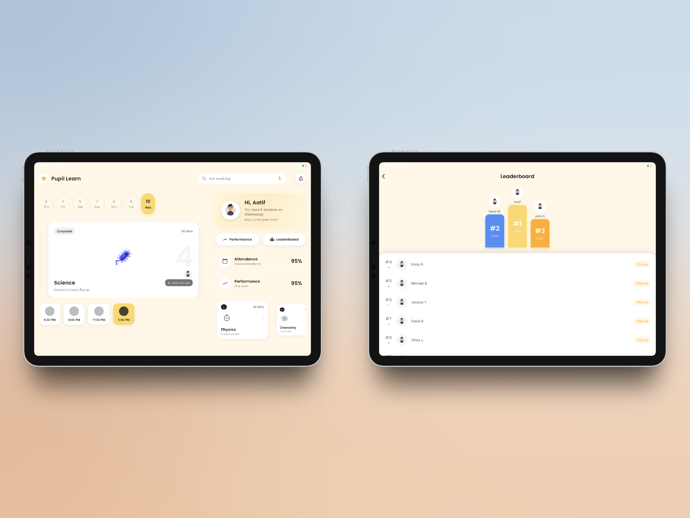
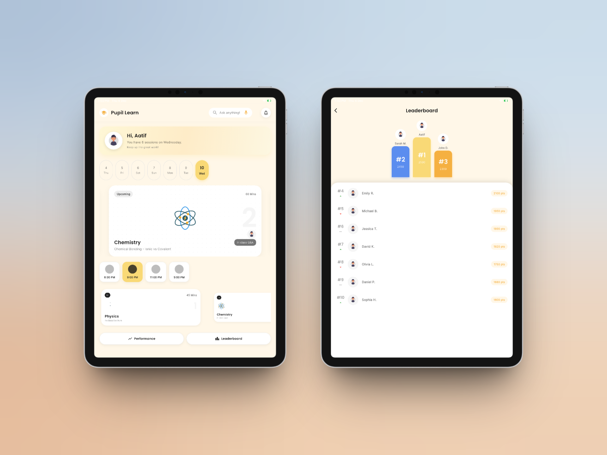

# School Learning App

A Flutter application designed for students to manage their classes, track performance, and compete on leaderboards.

## Features

- **Dashboard**: A central hub showing daily schedule, live classes, and quick stats.
- **Live Classes**: Real-time status of ongoing and upcoming classes with countdowns.
- **Performance Tracking**: Visual charts and badges to track academic progress.
- **Leaderboard**: A competitive view to see student rankings and compare scores.
- **Interactive UI**: Staggered animations, glassmorphism effects, and interactive cards.
- **State Management**: Uses `Provider` for efficient state management.

## Screenshots

The app was built primarily for the tablet landscape view. Below are screenshots taken on an iPad in both landscape and portrait modes.




## How to Run

1.  **Prerequisites**: Ensure you have Flutter installed and set up on your machine.
2.  **Clone the repository**:
    ```bash
    git clone <repository-url>
    cd school_app
    ```
3.  **Install dependencies**:
    ```bash
    flutter pub get
    ```
4.  **Run the app**:
    ```bash
    flutter run
    ```

## Packages Used

-   [provider](https://pub.dev/packages/provider): State management.
-   [lottie](https://pub.dev/packages/lottie): High-quality animations.
-   [google_fonts](https://pub.dev/packages/google_fonts): Custom typography.
-   [flutter_svg](https://pub.dev/packages/flutter_svg): SVG rendering.
-   [intl](https://pub.dev/packages/intl): Date and time formatting.

## APK

*()*
